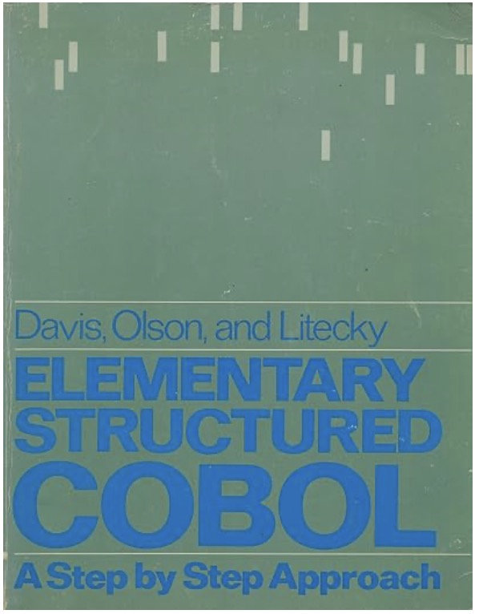

I have compiled the examples and exercises from the COBOL book **Elementary Structured COBOL: A Step-by-Step Approach** here.

The COBOL programs are saved as self-contained job streams and can be run directly, for example, on a card reader connected to JES2 on MVS 3.8 running on Hercules. I used a bare bone Jay Moseley Edition.
